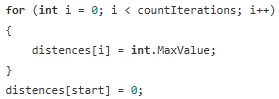

# Ошибки в классе Program.cs

1. Структурирование кода (логическое разбиение на методы):
 - **Ошибка**: в исходном коде часть логики программы находилась в Main(), что делало код менее читаемым _(Рисунок №1)_.
 

 

 - **Исправление**: в конечном коде логика была разбита на отдельные методы ReadInteger(), InitializeArray(), ReadGraphFromFile(), PrintGraph(), что улучшает читаемость кода _(Рисунок №2)_.
 

 

 2. Нарушение принципа «Не повторяйся»:
- **Ошибка**: в исходном коде инициализации массивов Pdestin и Pdepar дублировался _(Рисунок №3)_.

- **Исправление**: в конечном коде создан метод InitializeArray(), который выполняет эту задачу _(Рисунок №4)_.

3. Неинформативные названия классов, методов и переменных:
- **Ошибка**: в исходном коде использовался объект (класс) MDeyk и метод Deyk(), а также переменные (например, destin, Pdestin), что неясно указывает на их предназначение _(Рисунок №5)_.

- **Исправление**: в конечном коде переименовано в ClassForMethodDeykstry и MethodDeykstry() _(Рисунок №6)_.

4. Отсутствие обработок исключений:
- **Ошибка**: в исходном коде не было проверки на корректность ввода чисел, использование int.Parse() для преобразования переменной к типу данных int без проверки и необработанные ошибки при чтении файла _(Рисунок №7)_.

- **Исправление**: в конечном коде использован метод ReadInteger(), который проверяет ввод с помощью int.TryParse() и выбрасывает InvalidInputException при ошибке _(Рисунок №8)_. Проверяется line == null и выбрасывается FileReadException. Также перед парсингом проверяется, совпадает ли количество элементов в строке с ожидаемым _(Рисунок №9)_.

# Ошибки в классе ClassForMethodDeykstry.cs
1. Отсутствие проверки выхода за границы массива:
- **Ошибка**: в исходном коде start вводился без проверки, что могло привести к IndexOutOfRangeException, если пользователь вводил число, выходящее за границы массива _(Рисунок №10)_.

- **Исправление**: в конечном коде введена проверка в InitializeDistances(), и при выходе за границы выбрасывается OutOfBoundsException _(Рисунок №11)_.

2. Использование больших чисел:
- **Ошибка**: в исходном коде int.MaxValue использовался без пояснения. _(Рисунок №12)_.

- **Исправление**: в конечном коде этот же механизм оставлен, но теперь он четко привязан к логике метода InitializeDistances() _(Рисунок №13)_.

- **Остальная часть кода** в это классе имела такие же типы ошибок как и в классе Program.cs, а именно: 
    - повторение кода:
        - поиск минимального расстояния и обновление расстояний находились внутри Deyk()
        - теперь эта логика выделена в отдельные методы GetMinDistanceIndex() и UpdateDistances();
    - неинформативные наименования переменных, например, метод Deyk();
    - необработанные исключения:
        - InvalidInputException (ошибки ввода);
        - OutOfBoundsException (выход за границы массива);
        - Exception (другие неожиданные ошибки).